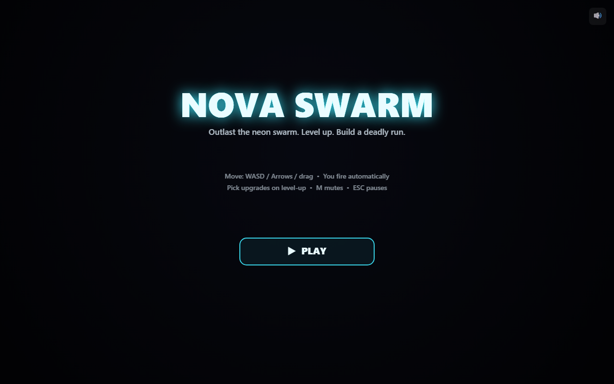
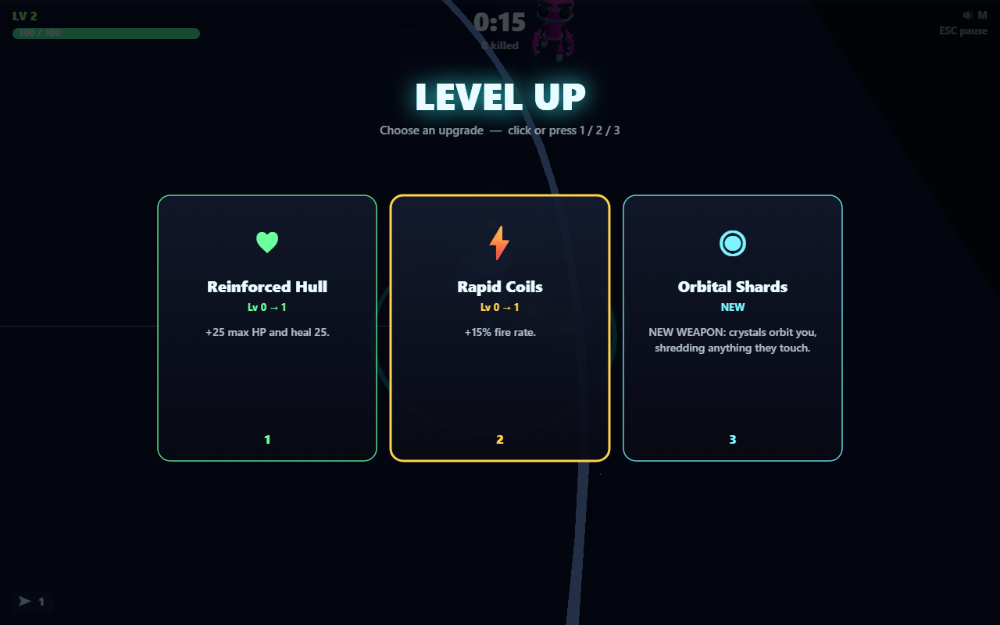
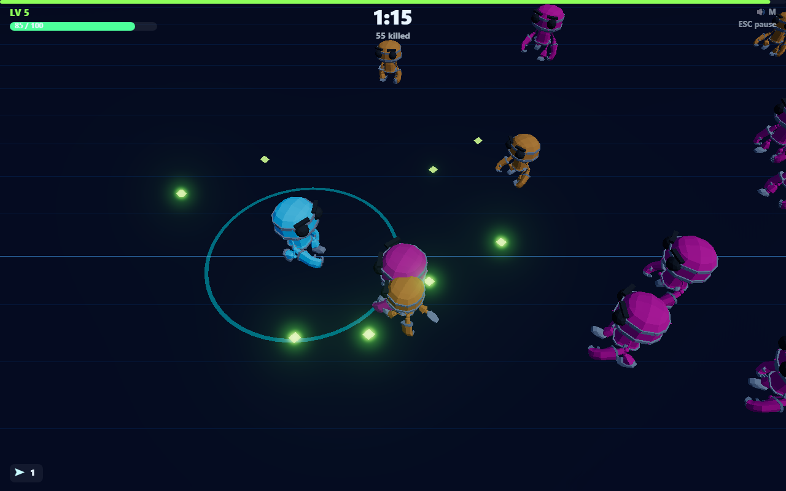

# NOVA SWARM

**A real-time 3D roguelite wave-survivor.** Outlast an endless swarm of rogue robots, sweep up glowing XP crystals, and choose an upgrade every level to sculpt a build that turns your lone robot into a screen-clearing storm. One more run.

> Built solo in 24 hours for the **Parsewave Game Jam** (build window: 10–11 July 2026).

- 🎮 **Play it:** `https://<your-deployment-url>`  ← _fill in after deploy (Vercel / GitHub Pages)_
- 📦 **Source:** `https://github.com/<you>/novaswarm`  ← _fill in_

| Title | Level-up | Gameplay |
|---|---|---|
|  |  |  |

---

## What it is

NOVA SWARM drops a single animated robot into a neon arena full of other robots that want it dead. You **only steer** — your weapons fire automatically — so every decision is about **positioning** and **build**:

- Kite the swarm, funnel enemies into your fire, and vacuum up the XP crystals they drop.
- Every level-up **freezes time** and offers **3 of 15 upgrades**. Stack them into a run.
- Five enemy archetypes (each a differently tinted, differently sized, differently animated robot) ramp in over time; a giant **Warden** boss crashes in every 2 minutes.
- Survive as long as you can. Your best time is saved locally. Then go again.

Rendered in real-time 3D: a fully rigged, skeletal-animated robot cast (walking/running/idle poses), dynamic lighting with a moving sun and colored rim lights, a selective bloom pass that makes bullets/gems/impacts glow, and a top-down follow camera with impact-driven screen shake.

### How to play

| | |
|---|---|
| **Move** | `WASD` / Arrow keys / drag (touch or mouse) |
| **Fire** | Automatic — aims the nearest enemy |
| **Level up** | Click a card or press `1` / `2` / `3` |
| **Pause** | `Esc` or `P` — then **Resume** or **Q** to quit to the title screen |
| **Mute** | `M` (or the speaker on the title) |

Everything is playable one-handed on desktop and with a single thumb on mobile (drag anywhere to steer). Any aspect ratio; the view scales to your screen.

### Upgrades & weapons

- **Blaster** (start) — auto-targeting shots; upgrades add fire rate, damage, projectiles, and pierce.
- **Orbital Shards** — crystals orbit you, shredding anything they touch.
- **Pulse Nova** — a periodic shockwave that damages and knocks back the swarm.
- Plus stat upgrades: max HP, regen, armor, move speed, crit, magnet radius, and XP gain.

---

## Built during the hackathon window

**100% of the code, gameplay design, and scene/lighting/effects work in this repo was created during the 24-hour window**, including a full mid-build pivot from a 2D canvas prototype to this real-time 3D version. The one external asset — a CC0-licensed robot model — is disclosed below.

- **Engine (from scratch):** fixed-timestep game loop with render interpolation, a uniform spatial hash for broad-phase collision, and object pooling for every entity (enemies, bullets, gems, particles) — all renderer-agnostic simulation code.
- **3D rendering (Three.js):** GLTF skeletal-animation pipeline with per-instance skeleton cloning and material tinting (one robot asset reused as the player, 5 enemy tiers, and a boss — differentiated by tint, scale, and animation clip), instanced-mesh pools for bullets/gems/particles (draw-call-cheap regardless of swarm size), a selective bloom post-process, dynamic + rim lighting, and a top-down follow camera with trauma-based screen shake.
- **Game:** player + stats system, 5 enemy archetypes with a spawn/difficulty director, a boss, 3 weapons, 15 upgrades, XP/leveling with a gem-magnet, and full run scoring.
- **Audio:** every sound is **synthesized live** in the Web Audio API (no audio files) — SFX plus an intensity-reactive procedural music bed.
- **UI:** a 2D canvas HUD overlay (title, HUD, level-up cards, pause with quit-to-menu, game-over) layered transparently on top of the WebGL canvas.
- **Testing & deploy:** a headless Playwright smoke test (boots the build, waits for the 3D asset to load, plays, asserts no runtime errors and that leveling works) and one-command deploy config.

See [`docs/DESIGN.md`](docs/DESIGN.md) for the architecture and design decisions, and [`docs/AI_WORKFLOW.md`](docs/AI_WORKFLOW.md) for how AI agents were used to plan, build, debug (including a real rendering-pipeline bug hunt), and balance the game.

---

## AI tools used

This game was built in an **agentic AI workflow** using **Claude Code** (Anthropic's CLI, model: Claude Sonnet 5) as the primary pair-engineer. The agent:

1. Proposed and scoped the concept, chose the tech stack, and laid out the module architecture — first for a 2D canvas build, then re-architected the rendering layer for a real-time 3D pivot requested mid-build, while keeping all simulation/balance code untouched.
2. Wrote the engine, game systems, and UI as strictly-typed TypeScript.
3. Sourced and verified the license of a real CC0 animated robot asset, rather than fabricating one or claiming a placeholder was final.
4. **Verified its own work in a real browser** — it drove the built game headlessly with Playwright, and root-caused two real bugs along the way: an XP-pacing stall (kills weren't translating to level-ups because gems dropped out of pickup range) and a 3D rendering bug (per-instance `InstancedMesh` colors rendering solid black), the latter isolated through a systematic elimination process — checking the raw GPU buffer data, bypassing post-processing, and comparing against a known-working non-instanced mesh — before landing on a robust fixed-color-pool redesign.

The full agent transcript, prompts, tool calls, and logs are included in the submission's `ai-traces.zip`. See [`docs/AI_WORKFLOW.md`](docs/AI_WORKFLOW.md).

---

## Run it locally

Requires **Node 18+** (built on Node 22).

```bash
npm install
npm run dev        # http://localhost:5173 with hot reload
```

Production build & preview:

```bash
npm run build      # type-checks (tsc --noEmit) then bundles with Vite → dist/
npm run preview    # serve the production build on http://localhost:4173
```

Optional headless smoke test (boots the build, waits for the 3D asset to load, plays ~20s, asserts no runtime errors and that leveling works):

```bash
npm run build
npx playwright install chromium   # one-time
npm run smoke
```

---

## Deploy

The build is a fully static bundle (`base: "./"`, so it works at any path) — no server, just static files including the ~450 KB robot model.

**Vercel** — import the repo (framework preset: _Vite_) or run:
```bash
npm i -g vercel && vercel --prod
```
`vercel.json` is included.

**GitHub Pages** — push to `main`; the included workflow at [`.github/workflows/deploy.yml`](.github/workflows/deploy.yml) builds and publishes to Pages automatically. (Enable Pages → Source: _GitHub Actions_ in repo settings once.)

---

## Tech stack

- **TypeScript** (strict) + **Vite** — no game framework for the simulation/UI layer; the engine is hand-rolled.
- **Three.js** for real-time 3D rendering: `GLTFLoader` + `SkeletonUtils` for animated character instancing, `InstancedMesh` for cheap-at-scale VFX, `EffectComposer` + `UnrealBloomPass` for the glow look.
- **HTML5 Canvas 2D** for the HUD/menu overlay layered on top of the WebGL canvas.
- **Web Audio API** for fully procedural sound.
- One asset dependency (the robot model — see Credits below); otherwise no runtime asset files.

## Project layout

```
src/
  core/     engine: math+RNG, loop, input, audio (renderer-agnostic)
  game/     config, types, world (pure simulation), player, enemies, upgrades, particles
  render/   Three.js layer: scene/lights/bloom, camera, robot loading+animation, instanced FX, world→scene sync
  ui/       2D HUD overlay: HUD bars, title/level-up/pause/game-over screens, 3D→2D label projection
  main.ts   canvas setup, asset preload, state machine, game loop
test/       headless Playwright smoke test
public/models/  the RobotExpressive.glb asset
docs/       design notes, AI workflow, screenshots
```

## Technical Architecture (deep dive)

This section goes deeper than the tech-stack summary above — it's for a reader who wants to understand *how* the systems actually work, not just what they're built with. (See also [`docs/DESIGN.md`](docs/DESIGN.md) for the design-rationale version of this same material, and [`docs/AI_WORKFLOW.md`](docs/AI_WORKFLOW.md) for how it was built and debugged.)

### System overview

```
┌─────────────────────────────────────────────────────────────────────┐
│ main.ts — state machine (loading → menu → playing ⇄ levelup/paused  │
│            → gameover) + GameLoop driver + dual-canvas compositing  │
└───────────────┬───────────────────────────────────┬─────────────────┘
                │ update(dt) fixed @60Hz             │ render() every rAF
                ▼                                     ▼
┌───────────────────────────────┐      ┌──────────────────────────────┐
│ game/World — PURE SIMULATION  │      │ render/WorldView — 3D SYNC   │
│  player, enemies[], bullets[],│─────▶│  reads World's pooled arrays │
│  gems[], particles, director, │ data │  writes Three.js transforms, │
│  upgrades, XP/level, RNG      │ only │  tints, animation clips      │
│  (renderer-agnostic)          │      │  (no gameplay logic here)    │
└───────────────┬───────────────┘      └──────────────┬───────────────┘
                │ SpatialGrid queries                  │ scene graph
                ▼                                       ▼
      core/grid.ts (broad-phase)          render/scene.ts (lights, bloom,
                                           ground, composer) + camera3d.ts
                                           (follow + shake) + fx.ts
                                           (instanced VFX) + robots.ts
                                           (GLTF load + per-instance clone)
```

The arrow between `World` and `WorldView` only ever flows one way: `World` never imports anything from `render/`, `core/`, or Three.js. It only exposes plain numbers, pooled struct arrays, and two narrow hooks — `setViewRadius(r)` (so the spawn director knows how far off-screen to place new enemies, without knowing what "screen" means) and `consumeTrauma()` (an accumulator that impact events bump and the camera drains into a shake offset). That one-way boundary is what let the whole rendering layer be swapped from Canvas 2D to Three.js mid-build without touching a single line of physics, spawn-timing, or balance code.

### Simulation core: fixed-timestep accumulator

`core/loop.ts` implements the classic "fix your timestep" pattern: `update(dt)` always receives a constant `dt = 1/60`, called 0, 1, or more times per animation frame depending on how much wall-clock time actually elapsed (an accumulator carries the remainder across frames). This is what makes movement speed, spawn cadence, damage-over-time, and every other rate-based system **identical** regardless of the player's monitor refresh rate — a 240Hz display doesn't make enemies spawn faster or the blaster fire quicker. `render()` runs once per `requestAnimationFrame` regardless of how many sim steps just ran, driven by the *actual* frame delta (`rdt`, clamped to 50ms) so animation-mixer blending and camera easing stay smooth even though the sim ticks in fixed chunks. A 0.25s clamp on the accumulator prevents the "spiral of death" (a stalled tab trying to catch up on thousands of missed steps at once) — reinforced by an explicit auto-pause on the `visibilitychange` event.

### Entity model: pooled structs, index-stable slots

Every transient thing in the game — enemies, player bullets, enemy bullets, XP/heal gems, hit-spark particles, floating combat text — is a plain object (`interface`, not a `class`) held in a flat array with a `dead: boolean` flag. "Spawning" means linear-scanning for a `dead` slot and overwriting its fields in place; nothing is ever `splice`d out mid-array. Two consequences fall out of this:

1. **Zero GC churn in the hot path.** After a brief warm-up, a long run allocates nothing per frame — no `new` calls for gameplay objects, so no garbage-collector stutter 40 minutes into a run.
2. **Index-stable slots are a free entity ID.** Because slot `enemies[7]` is never physically reordered, `render/worldView.ts` can keep a **parallel array of Three.js robot instances at the same index** and just ask each frame "is `enemies[i].dead`? hide `robots[i]` : sync its transform" — no ID-lookup map, no allocation, no diffing.

### Broad-phase collision: uniform spatial hash

Testing every bullet against every enemy is `O(bullets × enemies)`, which falls over once the swarm gets dense. `core/grid.ts` buckets enemies into a uniform grid (cell size 128 game-units) that's cleared and fully rebuilt every simulation step — rebuilding from scratch each step sounds wasteful but is actually the cheapest correct option here (no incremental-update bookkeeping, and a full rebuild of ~140 enemies into a `Map<number, Enemy[]>` is microseconds). Every damage query (blaster bullets, orbital contact-damage sampling, the nova's AoE pulse, the player's own contact-damage check, and the "nearest enemy" auto-aim query) then only inspects the handful of enemies in nearby cells instead of the whole population.

### 3D rendering pipeline

**Asset loading & instancing** (`render/robots.ts`): the single `RobotExpressive.glb` is loaded once via `GLTFLoader`. Every entity that needs a robot body — the player, each of the ~140 possible enemy slots — gets its own instance via `SkeletonUtils.clone()`, **not** `Object3D.clone()`. This distinction matters: a plain clone shares the same `Skeleton` (bone hierarchy) object across every copy, so animating one would visibly animate *all* of them in lockstep; `SkeletonUtils.clone` deep-clones the skeleton per instance while still sharing the underlying geometry buffers (cheap on GPU memory). Each instance also gets its own **cloned copy of just the "Main" material** (the robot's body-color material — the model ships three total: Grey, Main, Black), so `setTint()` can recolor one robot without recoloring every robot sharing that GPU program. An `AnimationMixer` + a small `play(clipName, fadeSeconds)` wrapper handle crossfading between the model's built-in clips (Idle / Walking / Running / Death, selected per enemy tier in `game/config.ts` alongside a per-tier `animSpeed` multiplier — tanks get a slow heavy "Walking" stomp, "fast" enemies get a sped-up "Running").

**Instanced VFX** (`render/fx.ts`): bullets, gems, and hit-particles are **not** individual `Mesh` objects — hundreds of those would mean hundreds of draw calls and matrix updates via the scene graph. Instead each effect type is a single `THREE.InstancedMesh` sized generously up front (e.g. 400 slots for player bullets), and syncing means writing each live entity's transform into `setMatrixAt(i, matrix)` and hiding the rest — one draw call per effect type, total, regardless of whether 3 or 300 are on screen. Color is **not** done via per-instance `instanceColor` (that path reliably rendered solid black in this environment — see the bug-hunt writeup in `DESIGN.md` — likely a SwiftShader/Three.js interaction specific to headless testing, worked around rather than chased further); instead each pool has one fixed material color, and gems/particles that need two colors (XP-green vs. heal-pink; generic white sparks vs. red hurt-sparks) simply get **two pools**, with live entities re-indexed into a compact `0..n` range each frame via a `hideFrom(n)` call that blanks the remainder.

**Lighting & atmosphere** (`render/scene.ts`): one shadow-casting `DirectionalLight` follows the player at a fixed offset (keeping its shadow-camera frustum tight and the shadow map sharp without covering the whole 3200×3200 arena), an ambient + hemisphere light provide fill, and two `PointLight`s slowly orbit the player at a fixed radius purely for neon-colored rim lighting (cheap: position updates only, no extra shadow maps). The ground plane is deliberately **emissive-tinted** rather than relying purely on scene lighting — the very first version reached correctly-lit robots standing on a completely black floor, traced to the ground plane's PBR-lit-only material reading as near-black under the available light budget; giving it its own emissive glow made it lighting-independent and robust.

**Post-processing**: `EffectComposer` → `RenderPass` → `UnrealBloomPass` → `OutputPass`. The bloom threshold is tuned so it only blooms genuinely bright/emissive things (bullets, gems, the arena boundary ring) while the tone-mapped, physically-lit robot materials stay under threshold and don't wash out.

### Camera: fixed-angle follow + trauma-squared shake

`render/camera3d.ts` deliberately does **not** orbit or rotate with the player — it holds a constant pitch/height/back-offset and damps its (x, z) position toward the player's ground-plane position (`damp()` is an exponential smoothing function: `lerp(a, b, 1 - e^(-λt))`, framerate-independent unlike a naive `a += (b-a) * 0.1`). This keeps the arena legible during a chaotic swarm — you always know which way is "up" on screen. Screen shake reuses the "trauma squared" model (trauma accumulates from impacts 0..1, decays over time, and the actual camera offset is `trauma²` in a random direction) so small hits barely register but a boss-kill or a death genuinely rattles the frame, without needing per-effect shake-amount tuning.

### Two-canvas compositing

The page stacks `#scene` (WebGL, Three.js) beneath `#hud` (2D canvas context, cleared to fully transparent every frame except where it actively draws). All crisp text, bars, and menu cards are 2D-canvas draw calls — far simpler than 3D text geometry or a DOM UI library — and `ui/labels3d.ts` bridges the two worlds for in-scene floating combat text: it takes a 3D world position, runs it through `Vector3.project(camera)` to get normalized device coordinates, converts those to HUD-canvas pixel coordinates, and draws the text there, so damage numbers correctly track their 3D origin point as the camera moves.

### Procedural audio

`core/audio.ts` has no audio files at all. Every SFX is a short `OscillatorNode` (or filtered noise buffer for impacts) with a hand-shaped gain envelope and a frequency sweep — e.g. the kill sound is a sawtooth sweeping 160Hz→40Hz layered with filtered noise. The background music is a self-scheduling loop (a `setTimeout` chain reading the AudioContext's own clock, not `setInterval`, to avoid drift) playing a bassline plus a randomized arpeggio over a minor-pentatonic scale, whose note density and detuning increase with a 0–1 "intensity" value the game feeds it from elapsed time + enemy count — so the music organically ramps as a run gets harder.

### State machine & upgrade system

`main.ts` runs an explicit `"loading" | "menu" | "playing" | "levelup" | "paused" | "gameover"` state machine (not a scene-graph of "screen" objects) — each state has one `handleX()` function polling `Input` and one branch in `render()`. Upgrades are implemented as a flat **stats bag** on `Player` (`damageMul`, `fireRateMul`, `projectileCount`, `pierceBonus`, per-weapon levels, …) that upgrade definitions simply mutate; weapons read derived getters off that bag, so the upgrade system has zero coupling to weapon internals — adding a 16th upgrade never requires touching `Blaster`/`Orbital`/`Nova` code.

### Performance budget & why the numbers are what they are

The 2D prototype ran up to 520 concurrent enemies (cheap flat-colored polygons). Real-time skeletal animation is not free, so the 3D build caps concurrent enemies at **140** and particles at **340** — sized to keep every `AnimationMixer.update()` and instanced-mesh sync well inside a 16ms frame budget on mid-range hardware, including the software-rendered (SwiftShader) path used for headless CI testing. Fewer, denser, individually-readable robots reads as "a swarm" just as well as hundreds of flat polygons did, especially with bloom and lighting doing atmospheric work the 2D version didn't have.

## Credits & disclosures

- **Design, code, gameplay, scene/lighting/effects, and audio:** all original, created during the jam window by the participant with Claude Code as an AI pair-engineer.
- **3D model:** [`RobotExpressive.glb`](https://github.com/mrdoob/three.js/tree/dev/examples/models/gltf/RobotExpressive) by [Tomás Laulhé](https://www.patreon.com/quaternius), **CC0 1.0** (public domain), with glTF conversion/cleanup by [Don McCurdy](https://donmccurdy.com/), distributed via the three.js examples repository. Used as-is (tinted per-instance in code; not re-modeled). This is the one non-original asset in the submission.
- **Libraries:** `three` (3D rendering, runtime dependency), `vite` and `typescript` (build tooling), `playwright` (dev-only, for the smoke test).
- **Fonts:** system UI fonts only (no third-party font files).
- **Audio:** none — fully procedural, generated in code at runtime.
- **Prior work / tutorials / templates:** none used beyond the disclosed model. The genre is inspired by _Vampire Survivors_; no code or other assets were taken from it or any other project.

## License

[MIT](LICENSE) © 2026 the author. The bundled `RobotExpressive.glb` remains CC0 1.0 per its original license (see Credits above).
